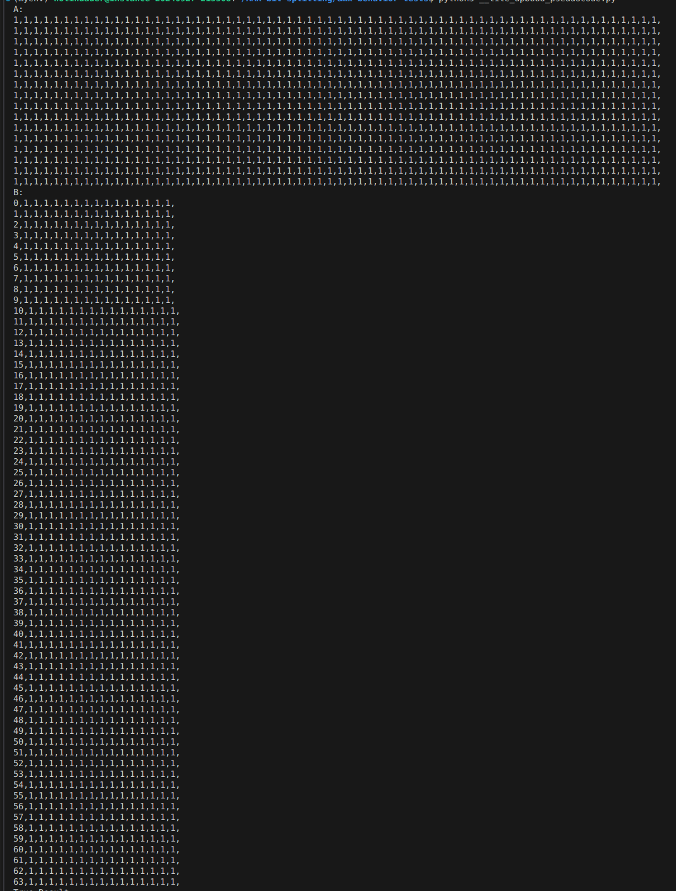
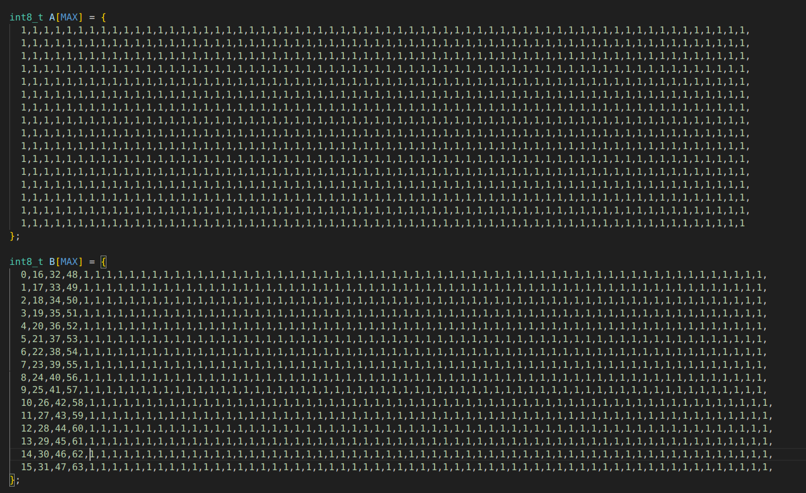

# Clear Explanation of AMX-Tile / TMUL Memory Layout Expectations #  


# Purpose

This repository seeks to provide a simple explanation of the memory layout expectations by AMX Tile registers. Documentation online is somewhat sparse aside from the [parent repo of this fork](https://github.com/intel/AMX-TMUL-Code-Samples), the [intel intrinsics guide](https://www.intel.com/content/www/us/en/docs/intrinsics-guide/index.html#amxtechs=AMX_INT8&ig_expand=6865), and the [Intel ISA extensions reference manual](intel-IDA-ref.pdf).

I found determining how to layout the memory in C for AMX intputs a bit confusing from viewing only the original code sample so i decided to put together this repo as a simpler explanation.


# How AMX Tiles Work

The intel AMX tile extensions provide 2D registers called tiles that enable the computation of an entire matrix multiplication in a single instruction. 

By default, AMX tile argument registers are 16 x 64, containing (u)int8 data. The output accumulator tile is 16x16, containing (u)int32 data.

Here is a brief snapshot of what it looks like to perform a matmul with AMX. src1 and src2 are both 1024 element int8_t C arrays.

    // load tile rows from memory
    _tile_loadd (2, src1, STRIDE);
    _tile_loadd (3, src2, STRIDE);
    _tile_loadd (1, res, STRIDE);

    // compute dot-product of bytes in tiles 
    _tile_dpbssd (1, 2, 3);

    // store the tile data to memory
    _tile_stored (1, res, STRIDE);


## src1 memory layout

src1 is expected to be a 16x64 matrix stored contiguously in row majory order within an int8_t array of 16x64=1024 elements. This data is stored within the 16x64 tile. 

NOTE: The size/dimmensions of the tile does not necessarily coincide with that of the matrix stored within it (as we will see with src2).

## src2 memory layout

src2 is also a int8_t C array of 1024 elements stored within the 16x64 AMX tile register. 

However, despite being stored in the 16x64 tile, src2 represents a 64x16 matrix. 

The C array that is loaded into the right-hand-side tile register contains the row-major order contiguous data of the 64x16 matrix. However that contiguous stream of data is *filled in along the columns*. This is not quite the same thing as column-major order.
## Visual Example:

For example, if the 16x64 and 64x16 matrices intended to be multiplied look like this:



Then the representation in memory for loading into AMX tiles will look like this:



## Building 
Perform the following steps:
1. Build the program. 

   ```   
    cd src/ 
    make 
    ```

2. Run the program 

    ```
    ./test-amxtile  
    ```

3. Clean the program  
  
    ```
    make clean  
    ```

